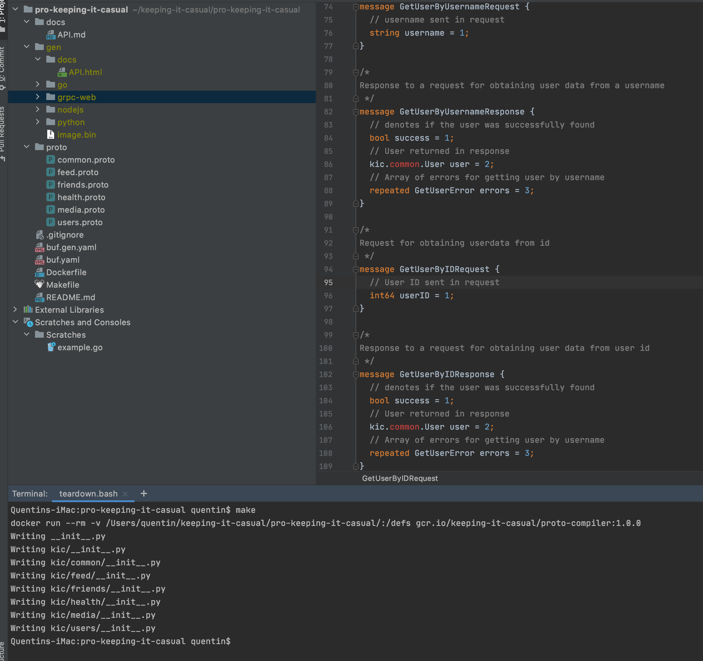

# Docker Intro

We are utilizing docker on our senior project for deployment and some utility tasks. The screenshot below shows an example of a docker image I created for our project which contains a collection
of protobuf and gRPC compilers for every language, and does the code generation for us. This is very useful as collecting the protobuf and gRPC compilers for all
languages is tedious, and code generation can be a hassle. Our image has all these items prepackaged so all a developer needs to do is run the image and mount the
proper directories, and all the code appears. 

